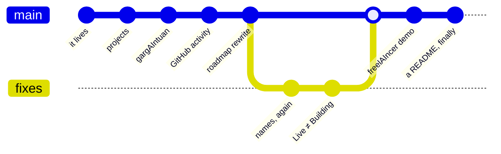

# ijneb.dev

> **Benji Zorella — Development. Cyber Security. AIthropology.**

The personal site. Static HTML, served straight off GitHub Pages at
[ijneb.dev](https://ijneb.dev).

## TL;DR

```
Framework ................ none
Build step ............... none
node_modules ............. none
Bundler .................. none
Time to first byte ....... whatever your DNS is doing
Files you can read ....... all of them
```

It's `index.html`. It has always been `index.html`. Every few years the industry
reinvents this and gives it a name with a number in it.

## Layout

| Path | What |
|---|---|
| `index.html` | The site. Projects, roadmap, GitHub activity. |
| `blog/` | Long-form. Currently: *It Lives*, *Shadow IT Grew Up*, *Something Purple This Way Comes*. |
| `freelaincer/` | freelAIncer demo path. |
| `CNAME` | The bit that makes it `ijneb.dev` and not a github.io mouthful. |
| `robots.txt`, `sitemap.xml` | For the crawlers, with love. |

## How it ships

```
git push origin main   →   GitHub Pages   →   ijneb.dev
```

That's the pipeline. No YAML was harmed.

## Commit graph



Eleven commits in, roughly half of them renaming a project after deciding the
capital `AI` belonged somewhere else. `gargAIntuan`, `renovAIter`, `carcAIre`,
`debAIser`, `prepAIred`, `cabinAIt` — the vowel placement is load-bearing.

## Related

Business and client work lives in a private repo, deliberately not this one.
If you found something here that looks like a credential, it's a prop — but
[tell me anyway](https://ijneb.dev).
